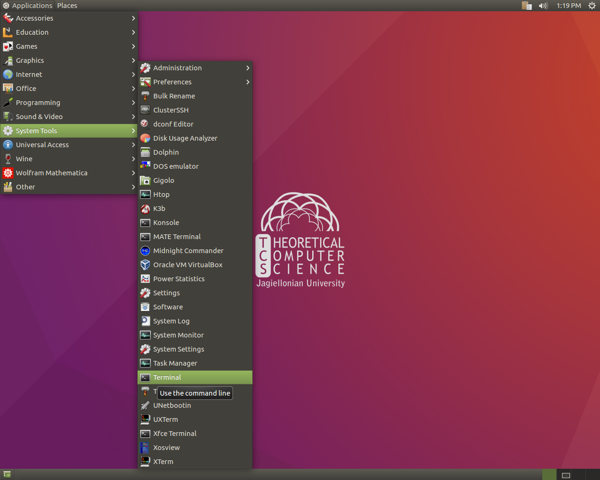

1. Uruchom komputer

2. Wybierz system `linux - TCS`

3. Zaloguj się jako użytkownik `guest`, pole hasło pozostaw puste

4. Jeśli kiedykolwiek się pojawi prośba o podanie hasła dla nowej bazy kluczy, kliknij w `Cancel`

5. Uruchom terminal


6. Wpisz:
```
git clone https://github.com/Larhard/rand-12
cd rand-12
./setup.sh 
```
